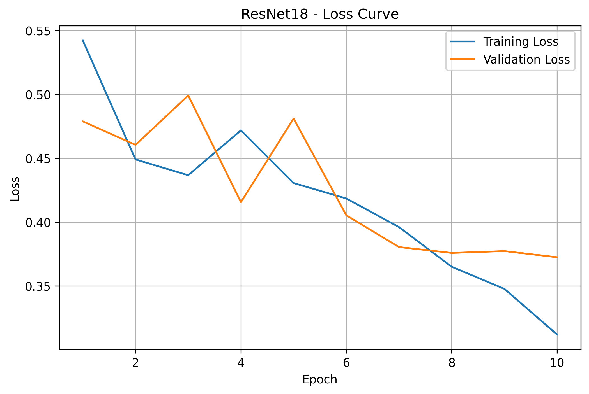
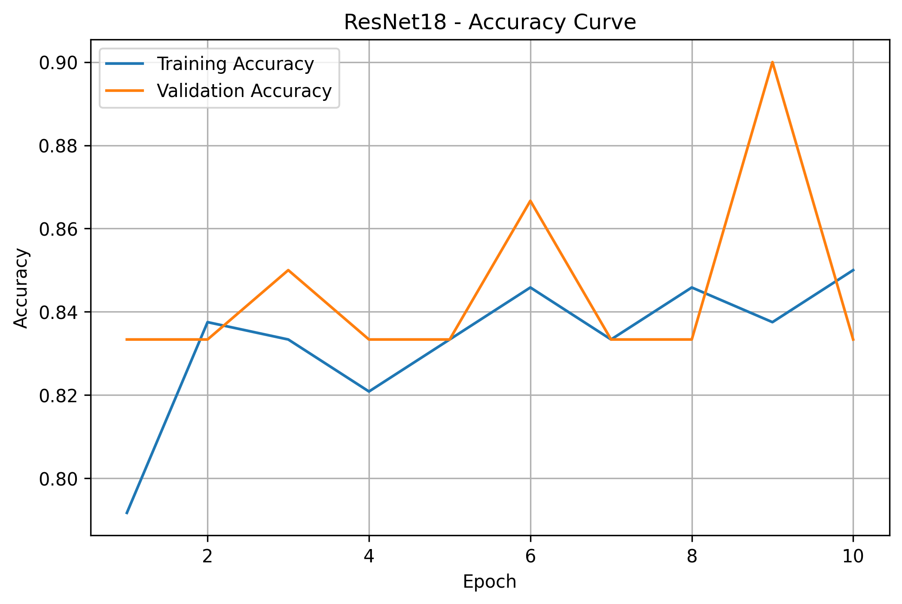
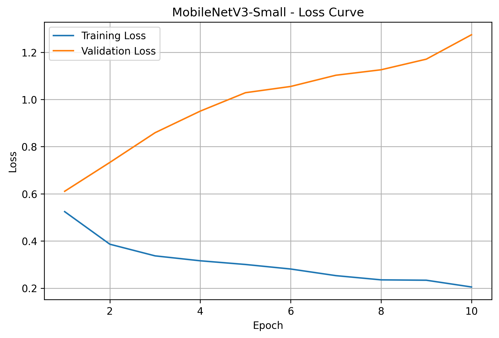
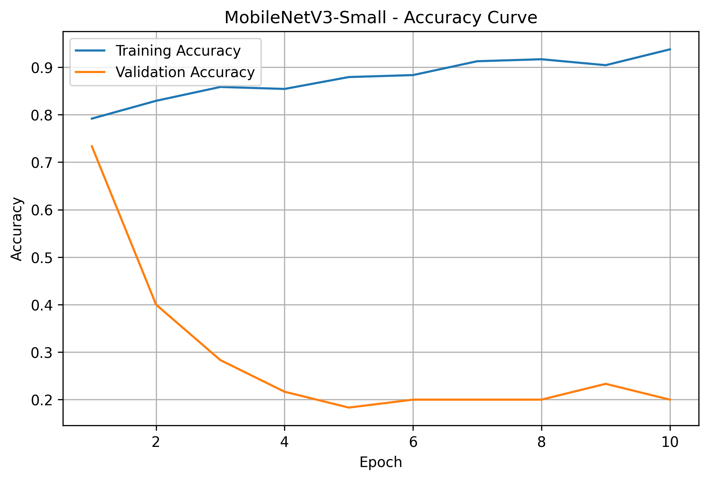
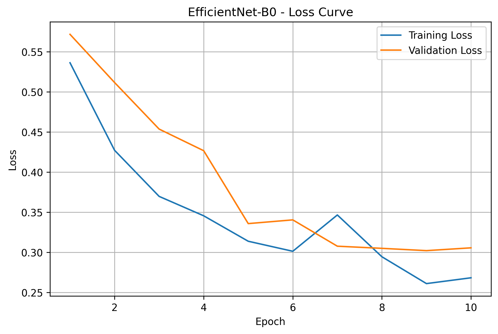
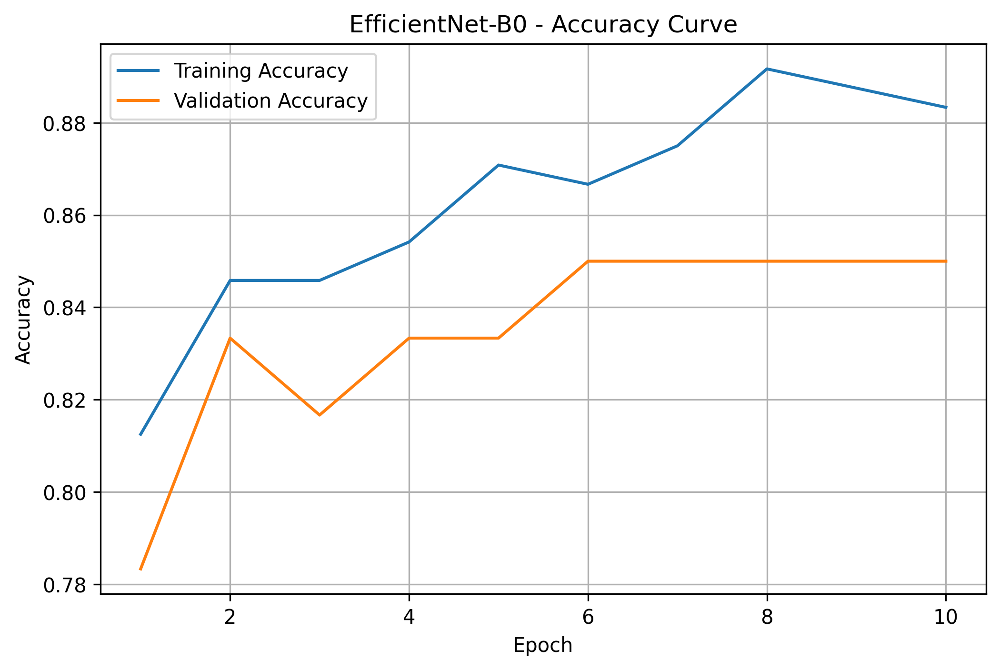

# Automated Product Defect Detection Using Transfer Learning

## 1. Project Overview

Automated visual inspection is an important application of computer vision in manufacturing. Manual inspection of manufactured components can be time-consuming, inconsistent, and difficult to scale. This project develops an image classification system that automatically identifies whether a product image represents a normal product or a defective product.

The project focuses on binary product defect classification using transfer learning with three pretrained Convolutional Neural Network (CNN) architectures:

* ResNet18
* MobileNetV3-Small
* EfficientNet-B0

The models are trained and evaluated on a screw defect dataset. The main objective is to compare the performance of different pretrained CNN architectures under the same preprocessing, train-validation split, and training configuration.

The project includes the complete workflow from dataset preparation and image preprocessing to model training, evaluation, misclassification analysis, model comparison, and test-set prediction.

### Key Components

* Dataset loading and label processing
* Image preprocessing
* Stratified 80/20 train-validation split
* Transfer learning using pretrained CNNs
* Model training and validation
* Accuracy, precision, recall, and F1-score evaluation
* Confusion matrix generation
* Training and validation loss curves
* Training and validation accuracy curves
* Misclassified image analysis
* Comparison of three pretrained CNN architectures
* Final predictions on the unlabeled test dataset

---

# 2. Problem Statement

The objective of this project is to develop a binary image classification system for automated product quality inspection.

Given an image of a manufactured screw, the system classifies it into one of two categories:

| Label | Classification         |
| ----- | ---------------------- |
| 0     | Normal / Non-defective |
| 1     | Defective / Anomalous  |

The system learns visual patterns from labeled screw images and attempts to distinguish defective products from normal products.

Such a system can support automated quality-control processes by providing a consistent initial screening mechanism and reducing the dependence on manual visual inspection.

---

# 3. Dataset

The project uses the Screw Dataset available through Kaggle.

**Dataset:** Screw Dataset
**Source:** Kaggle
**Dataset:** ruruamour/screw-dataset

The dataset can be obtained from:

https://www.kaggle.com/datasets/ruruamour/screw-dataset

The relevant dataset structure is:

```text
dataset/
├── train/
├── test/
└── train.csv
```

The `train.csv` file contains the following columns:

```text
filename
anomaly
```

The `anomaly` column is used as the target label:

```text
anomaly = 0  → Normal
anomaly = 1  → Defective
```

The labeled dataset used in this project contains approximately 300 images.

The class distribution is:

| Class     | Number of Images |
| --------- | ---------------: |
| Normal    |              250 |
| Defective |               50 |
| Total     |              300 |

The dataset therefore contains considerably more normal samples than defective samples.

To maintain the class distribution between the training and validation sets, a stratified 80/20 split was used.

The resulting split contains approximately:

| Dataset    | Normal | Defective | Total |
| ---------- | -----: | --------: | ----: |
| Training   |    200 |        40 |   240 |
| Validation |     50 |        10 |    60 |

The `test/` directory contains unlabeled images and is used separately for generating predictions after model training.

---

# 4. Data Preprocessing

All images are converted into a consistent format before being provided to the CNN models.

The preprocessing pipeline consists of:

1. Resizing every image to 224 × 224 pixels
2. Converting the image to a PyTorch tensor
3. Normalizing the image using ImageNet normalization statistics

The normalization parameters are:

```text
Mean = [0.485, 0.456, 0.406]
Standard Deviation = [0.229, 0.224, 0.225]
```

The same preprocessing pipeline is applied to all three models so that the architectures can be compared under the same conditions.

## No Random Augmentation

Random data augmentation was intentionally not used in this project.

The following transformations were not applied:

* Random horizontal flipping
* Random vertical flipping
* Random rotation
* Random cropping
* Random brightness adjustment
* Random contrast adjustment

Instead, deterministic preprocessing was used throughout the experiment. This ensures that the same image is processed consistently each time it is passed through the pipeline.

---

# 5. Train-Validation Split

The labeled data was divided using an 80/20 stratified split.

```text
80% → Training
20% → Validation
```

Stratification was used because the dataset is imbalanced. It ensures that both the training and validation sets maintain approximately the same proportion of normal and defective samples.

The training set is used to update the model parameters, while the validation set is used to measure model performance on unseen labeled images.

The validation set is not used for updating the model weights.

---

# 6. Transfer Learning

Training a deep CNN completely from scratch generally requires a large amount of labeled data. Since the available dataset is relatively small, transfer learning was used.

Transfer learning allows a pretrained CNN to reuse visual features learned from a large image dataset.

For this project, three pretrained CNN architectures were selected:

1. ResNet18
2. MobileNetV3-Small
3. EfficientNet-B0

The pretrained feature extraction layers are retained, while the final classification layer is adapted for the two-class defect classification problem.

The models therefore produce predictions for:

```text
Class 0 → Normal
Class 1 → Defective
```

Using the same transfer-learning strategy for all three architectures provides a consistent basis for comparison.

---

# 7. Models Used

## 7.1 ResNet18

ResNet18 is a convolutional neural network architecture that uses residual connections.

Residual connections allow information to pass through shortcut connections within the network and help make the training of deeper networks more effective.

In this project, pretrained ResNet18 weights are used and the final classification layer is replaced to support the two target classes.

ResNet18 provides a strong and widely used baseline for image classification and transfer-learning experiments.

---

## 7.2 MobileNetV3-Small

MobileNetV3-Small is a lightweight CNN architecture designed with computational efficiency in mind.

It is particularly useful for applications where model size and inference efficiency are important.

The pretrained MobileNetV3-Small model is adapted by replacing its final classifier for the two-class defect detection task.

Its lightweight architecture makes it an interesting alternative to larger CNN models.

---

## 7.3 EfficientNet-B0

EfficientNet-B0 is an efficient CNN architecture designed to achieve a strong balance between model size, computational requirements, and classification performance.

The pretrained EfficientNet-B0 model is adapted for binary defect classification by replacing its final classification layer.

It provides another transfer-learning approach for comparison with ResNet18 and MobileNetV3-Small.

---

# 8. Training Configuration

The same primary training configuration was used for all three models.

| Parameter                 | Configuration       |
| ------------------------- | ------------------- |
| Number of classes         | 2                   |
| Input image size          | 224 × 224           |
| Train-validation split    | 80:20               |
| Number of epochs          | 10                  |
| Loss function             | CrossEntropyLoss    |
| Optimizer                 | Adam                |
| Learning rate             | 0.001               |
| Pretrained weights        | Yes                 |
| Random augmentation       | No                  |
| Model selection criterion | Validation F1-score |

The pretrained model backbones are used as feature extractors and the classification layer is trained for the defect detection task.

---

# 9. Loss Function

Cross Entropy Loss is used as the classification loss.

The models generate two output scores corresponding to the two classes:

```text
Class 0 → Normal
Class 1 → Defective
```

The loss measures the difference between the predicted class probabilities and the actual class labels and is used to update the trainable parameters during training.

---

# 10. Optimizer

The Adam optimizer is used for training.

The learning rate is:

```text
0.001
```

Adam provides adaptive learning rates for the trainable parameters and is commonly used for neural-network optimization.

---

# 11. Evaluation Metrics

The models were evaluated using four primary classification metrics:

* Accuracy
* Precision
* Recall
* F1-score

Because the dataset is imbalanced, accuracy alone is not sufficient to fully understand defect-detection performance.

## Accuracy

Accuracy measures the overall proportion of correctly classified images.

```text
Accuracy = Correct Predictions / Total Predictions
```

## Precision

Precision measures how many of the images predicted as defective were actually defective.

```text
Precision = TP / (TP + FP)
```

A high precision indicates that the model produces fewer false defect alarms.

## Recall

Recall measures how many of the actual defective products were correctly detected.

```text
Recall = TP / (TP + FN)
```

Recall is especially important in defect detection because a false negative represents a defective product that was classified as normal.

## F1-Score

F1-score combines precision and recall into a single metric.

```text
F1 = 2 × Precision × Recall / (Precision + Recall)
```

Since the dataset contains fewer defective images than normal images, F1-score was used as the primary criterion for selecting the best-performing model.

---

# 12. Training Process

Each model was trained for 10 epochs.

During every epoch, the following values were recorded:

* Training loss
* Training accuracy
* Validation loss
* Validation accuracy
* Validation F1-score

The model checkpoint with the best validation F1-score was saved during training.

This approach ensures that the final selected model is not simply the model from the last training epoch, but the model that achieved the strongest validation F1-score during training.

---

# 13. Training Results

The three models produced different validation performances.

## ResNet18

ResNet18 achieved the strongest overall validation performance.

| Metric    |  Result |
| --------- | ------: |
| Accuracy  |  90.00% |
| Precision | 100.00% |
| Recall    |  40.00% |
| F1-score  |  57.14% |

The model achieved a validation accuracy of 90%. Its precision reached 100%, meaning that the samples predicted as defective were correctly identified as defective in the final validation evaluation.

However, its recall was 40%, indicating that the model did not identify all defective samples.

The resulting F1-score was 57.14%, which was the highest among the three models.

---

## MobileNetV3-Small

MobileNetV3-Small achieved the following validation results:

| Metric    | Result |
| --------- | -----: |
| Accuracy  | 73.33% |
| Precision | 31.25% |
| Recall    | 50.00% |
| F1-score  | 38.46% |

MobileNetV3-Small achieved a recall of 50%, which was the highest recall among the three models.

However, its precision was considerably lower at 31.25%, indicating a larger number of false-positive predictions.

Its final F1-score was 38.46%.

---

## EfficientNet-B0

EfficientNet-B0 achieved:

| Metric    | Result |
| --------- | -----: |
| Accuracy  | 85.00% |
| Precision | 66.67% |
| Recall    | 20.00% |
| F1-score  | 30.77% |

EfficientNet-B0 achieved an accuracy of 85% and a precision of 66.67%.

However, its recall was only 20%, meaning that it detected a relatively small proportion of the defective samples in the validation set.

Its resulting F1-score was 30.77%.

---

# 14. Overall Model Comparison

The complete comparison is summarized below:

| Model             |   Accuracy |   Precision |     Recall |   F1-score |
| ----------------- | ---------: | ----------: | ---------: | ---------: |
| **ResNet18**      | **90.00%** | **100.00%** |     40.00% | **57.14%** |
| MobileNetV3-Small |     73.33% |      31.25% | **50.00%** |     38.46% |
| EfficientNet-B0   |     85.00% |      66.67% |     20.00% |     30.77% |

Based on the validation F1-score, **ResNet18 was the best-performing model**, achieving an F1-score of 57.14%.

ResNet18 also achieved the highest validation accuracy at 90% and the highest precision at 100%.

MobileNetV3-Small achieved the highest recall at 50%. This means it detected a larger proportion of defective samples than the other two models, but its low precision resulted in a lower overall F1-score.

EfficientNet-B0 achieved the second-highest accuracy at 85%, but its recall of 20% resulted in the lowest F1-score among the three models.

The results demonstrate why multiple evaluation metrics are important for defect detection rather than relying only on accuracy.

The detailed comparison is also stored in:

```text
results/model_comparison.csv
```

A consolidated summary is available in:

```text
results/final_summary.txt
```

---

# 15. Confusion Matrices

Confusion matrices are generated for all three models to provide a more detailed view of their classification behavior.

They show the number of:

* True Negatives
* False Positives
* False Negatives
* True Positives

## ResNet18


The ResNet18 confusion matrix helps visualize its high precision and relatively lower recall.

---

## MobileNetV3-Small


The MobileNetV3-Small confusion matrix helps explain its higher recall but substantially lower precision.

---

## EfficientNet-B0


The EfficientNet-B0 confusion matrix provides additional insight into its lower recall despite achieving relatively high accuracy.

---

# 16. Training and Validation Curves

Training and validation curves were generated for each model.

These curves allow the training behavior of the models to be analyzed across the ten epochs.

For each architecture, two plots are generated:

* Loss curve
* Accuracy curve

## ResNet18

Loss curve:

```text
results/ResNet18/loss_curve.png
```

Accuracy curve:

```text
results/ResNet18/accuracy_curve.png
```





## MobileNetV3-Small

Loss curve:

```text
results/MobileNetV3_Small/loss_curve.png
```

Accuracy curve:

```text
results/MobileNetV3_Small/accuracy_curve.png
```





## EfficientNet-B0

Loss curve:

```text
results/EfficientNet_B0/loss_curve.png
```

Accuracy curve:

```text
results/EfficientNet_B0/accuracy_curve.png
```





---

# 17. Misclassified Image Analysis

The project stores up to three misclassified validation images for each model.

These images help analyze difficult cases where the model's prediction differs from the actual label.

The misclassified samples can provide insight into:

* False-positive predictions
* False-negative predictions
* Visually subtle defects
* Normal products that resemble defective products
* Defective products that are difficult to distinguish from normal products

The misclassified images are stored in the following directories:

```text
results/ResNet18/misclassified/
results/MobileNetV3_Small/misclassified/
results/EfficientNet_B0/misclassified/
```

Examples of generated misclassified images include:

```text
error_1_manipulated_front000.png
error_2_scratch_head007.png
error_3_thread_top000.png
```

The exact misclassified images differ between models.

---

# 18. Test Set Prediction

The dataset provides an unlabeled test set.

After training and validation, predictions are generated for the test images.

The predictions are stored in:

```text
results/test_predictions.csv
```

The test data is kept separate from the labeled training and validation data.

The test set is not used to update model parameters.

---

# 19. Project Structure

The repository is organized as follows:

```text
automated_product_defect_detection/
│
├── main.py
├── requirements.txt
├── README.md
│
├── Model/
│   ├── ResNet18.pth
│   ├── MobileNetV3_Small.pth
│   └── EfficientNet_B0.pth
│
└── results/
    │
    ├── model_comparison.csv
    ├── final_summary.txt
    ├── test_predictions.csv
    │
    ├── ResNet18/
    │   ├── metrics.txt
    │   ├── loss_curve.png
    │   ├── accuracy_curve.png
    │   ├── confusion_matrix.png
    │   └── misclassified/
    │
    ├── MobileNetV3_Small/
    │   ├── metrics.txt
    │   ├── loss_curve.png
    │   ├── accuracy_curve.png
    │   ├── confusion_matrix.png
    │   └── misclassified/
    │
    └── EfficientNet_B0/
        ├── metrics.txt
        ├── loss_curve.png
        ├── accuracy_curve.png
        ├── confusion_matrix.png
        └── misclassified/
```

---

# 20. Main Files

## main.py

Contains the complete implementation of the project, including:

* Dataset loading
* Label processing
* Train-validation splitting
* Image preprocessing
* Model creation
* Transfer learning
* Model training
* Validation
* Metric calculation
* Confusion matrix generation
* Training curve generation
* Misclassified image extraction
* Model comparison
* Test-set prediction

## requirements.txt

Contains the Python packages required to run the project.

The primary dependencies include:

```text
torch
torchvision
pandas
numpy
scikit-learn
matplotlib
Pillow
seaborn
tqdm
```

## Model/

Contains the trained model weights:

```text
ResNet18.pth
MobileNetV3_Small.pth
EfficientNet_B0.pth
```

## results/

Contains all generated evaluation outputs and visualizations.

---

# 21. Running the Project

## Google Colab

This project was developed and executed primarily in Google Colab.

Google Colab was selected because the training of pretrained CNN models benefits significantly from GPU acceleration. Using a GPU reduces the training time compared with running the same experiment entirely on a CPU.

To enable GPU acceleration in Google Colab:

```text
Runtime
→ Change runtime type
→ Hardware accelerator
→ GPU
```

After enabling the GPU, verify that PyTorch can access it:

```python
import torch

print(torch.cuda.is_available())
```

The expected output when a GPU is available is:

```text
True
```

---

# 22. Dataset Setup in Colab

Download the Screw Dataset from Kaggle:

https://www.kaggle.com/datasets/ruruamour/screw-dataset

The expected directory structure inside the Colab environment is:

```text
/content/
│
├── main.py
├── requirements.txt
│
└── dataset/
    ├── train/
    ├── test/
    └── train.csv
```

The dataset path used by the project is:

```text
dataset
```

If the dataset is stored in a different location, update the dataset path in `main.py`.

---

# 23. Installing Dependencies in Colab

After opening the project in Google Colab, install the required packages using:

```python
!pip install -r requirements.txt
```

If PyTorch and torchvision are already available in the Colab environment, they do not necessarily need to be reinstalled.

---

# 24. Running main.py in Colab

Once the dataset and project files are available, run:

```python
!python main.py
```

The script will:

1. Load the dataset.
2. Process the labels.
3. Create the stratified train-validation split.
4. Apply deterministic image preprocessing.
5. Load the pretrained CNN architectures.
6. Train ResNet18.
7. Train MobileNetV3-Small.
8. Train EfficientNet-B0.
9. Evaluate all three models.
10. Generate the evaluation metrics.
11. Generate confusion matrices.
12. Generate loss and accuracy curves.
13. Save misclassified validation images.
14. Compare model performance.
15. Generate test-set predictions.
16. Save the trained model weights.

The complete execution can take some time depending on the GPU allocated by Google Colab.

---

# 25. Running Locally

The project can also be run on a local computer.

Clone the repository:

```bash
git clone https://github.com/mshreya006/automated_product_defect_detection.git
```

Move into the project directory:

```bash
cd automated_product_defect_detection
```

Install the dependencies:

```bash
pip install -r requirements.txt
```

Place the dataset in the following location:

```text
dataset/
├── train/
├── test/
└── train.csv
```

Then run:

```bash
python main.py
```

For GPU-based local execution, a compatible NVIDIA GPU and compatible CUDA/PyTorch setup are required.

---

# 26. Reproducing the Experiment

To reproduce the experiment as closely as possible:

1. Download the same Screw Dataset.
2. Place the dataset inside the `dataset/` directory.
3. Install the dependencies listed in `requirements.txt`.
4. Use a GPU-enabled Google Colab environment or a compatible local GPU.
5. Run `main.py`.
6. Allow all three models to complete training.
7. Review the generated files inside `results/`.
8. Compare the metrics in `model_comparison.csv`.
9. Review the confusion matrices.
10. Review the training and validation curves.
11. Examine the misclassified images.
12. Review the generated test predictions.

The same preprocessing, split strategy, training configuration, and evaluation methodology should be maintained when reproducing the experiment.

---

# 27. Results Interpretation

The experiment demonstrates that model architecture can have a significant impact on defect classification performance.

ResNet18 achieved the strongest overall validation performance, with:

* 90.00% accuracy
* 100.00% precision
* 40.00% recall
* 57.14% F1-score

Its high precision indicates that when it classified an image as defective, that prediction was highly reliable in the validation results. However, its recall of 40% indicates that it still missed some defective products.

MobileNetV3-Small achieved the highest recall at 50%. This means it detected a larger proportion of defective samples than ResNet18 and EfficientNet-B0. However, its precision was only 31.25%, indicating that it also incorrectly classified a significant number of normal samples as defective.

EfficientNet-B0 achieved 85% accuracy and 66.67% precision, but its recall was only 20%. This indicates that although its overall accuracy was relatively high, it missed many defective samples.

These results demonstrate the importance of considering precision, recall, and F1-score alongside accuracy, particularly when working with an imbalanced defect-detection dataset.

---

# 28. Best Performing Model

Based on the primary model-selection criterion of validation F1-score, **ResNet18 was selected as the best-performing model**.

Its validation F1-score was:

```text
57.14%
```

It also achieved the highest validation accuracy:

```text
90.00%
```

and the highest precision:

```text
100.00%
```

Among the three models, MobileNetV3-Small achieved the highest recall, while ResNet18 achieved the best balance between precision and recall according to the F1-score.

The trained model weights are available in:

```text
Model/ResNet18.pth
```

---

# 29. Limitations

## Limited Dataset Size

The labeled dataset contains approximately 300 images. This is relatively small for training and evaluating image classification models.

A larger dataset would provide more examples of normal products and different types of defects.

## Class Imbalance

There are substantially more normal images than defective images.

The dataset contains approximately:

```text
250 Normal
50 Defective
```

This imbalance can influence the classification metrics, particularly accuracy.

For this reason, precision, recall, F1-score, and confusion matrices were also considered.

## Limited Defect Diversity

The available defective samples may not represent every possible type of manufacturing defect.

A model trained on a limited set of defect patterns may have difficulty recognizing defects that differ significantly from those seen during training.

## Validation Dataset Size

The validation set contains approximately 60 images, including only around 10 defective samples.

Because of the relatively small number of defective validation examples, the precision, recall, and F1-score can change significantly with individual predictions.

## Frozen Feature Extractor

The transfer-learning setup primarily uses the pretrained networks as feature extractors while adapting the final classification layer.

Further fine-tuning of selected pretrained layers could potentially improve performance.

## Real-World Generalization

The dataset images may not fully represent real manufacturing environments.

Real-world deployment can introduce variations such as:

* Lighting conditions
* Camera angles
* Product orientation
* Background changes
* Image resolution
* Different defect types
* Different product conditions

Therefore, additional real-world testing would be required before deployment in a production environment.

---

# 30. Future Improvements

Several improvements could be explored in future versions of the project.

### Larger Dataset

Collecting more normal and defective samples would improve model generalization.

### More Defect Types

Including a wider variety of manufacturing defects would allow the system to recognize a broader range of quality issues.

### Fine-Tuning

Instead of training only the final classifier, selected deeper layers of the pretrained CNN could also be fine-tuned.

### Hyperparameter Optimization

The following parameters could be optimized:

* Learning rate
* Batch size
* Number of epochs
* Optimizer
* Weight decay
* Number of trainable layers

### Class Imbalance Handling

Techniques such as class-weighted loss, controlled sampling, or other imbalance-handling strategies could be evaluated.

### Controlled Data Augmentation

Although random augmentation was not used in this experiment, carefully selected augmentation techniques could be evaluated in a future experiment if they are appropriate for the manufacturing images.

### Additional Architectures

Other CNN architectures could be evaluated to determine whether they provide better defect detection performance.

### Object Detection and Segmentation

The current project performs image-level classification.

Future versions could use object detection or segmentation to identify the exact location and region of the defect within the product.

### Deployment

The final model could be deployed as:

* A web-based inspection application
* A Streamlit application
* An edge-device inspection system
* A real-time camera-based quality-control system

---

# 31. Technologies Used

### Programming Language

Python

### Deep Learning

PyTorch
Torchvision

### Machine Learning

Scikit-learn

### Data Processing

NumPy
Pandas
Pillow

### Visualization

Matplotlib
Seaborn

### Development Environment

Google Colab

### Version Control

Git
GitHub

---

# 32. Complete Workflow

The overall workflow of the project is:

```text
Screw Dataset
      |
      v
Load Images and Labels
      |
      v
Stratified 80/20 Split
      |
      v
Resize to 224 × 224
      |
      v
Convert to Tensor
      |
      v
ImageNet Normalization
      |
      v
Pretrained CNN Models
      |
      +------------------+
      |                  |
      v                  v
  ResNet18        MobileNetV3-Small
      |                  |
      +--------+---------+
               |
               v
        EfficientNet-B0
               |
               v
        Model Training
               |
               v
         Validation
               |
               v
 Accuracy / Precision / Recall / F1
               |
               v
       Confusion Matrices
               |
               v
     Misclassified Images
               |
               v
       Model Comparison
               |
               v
       Best Model Selection
               |
               v
       Test Set Prediction
```

---

# 33. Conclusion

This project implements an automated product defect detection system using transfer learning and pretrained CNN architectures.

Three different CNN models, ResNet18, MobileNetV3-Small, and EfficientNet-B0, were trained and evaluated for binary classification of normal and defective screw images.

A deterministic preprocessing pipeline was used without random augmentation. A stratified 80/20 train-validation split was used to maintain the class distribution between the two subsets.

The models were evaluated using accuracy, precision, recall, F1-score, confusion matrices, training curves, and misclassified images.

Among the three architectures, ResNet18 achieved the best overall validation performance based on F1-score, with an accuracy of 90.00% and an F1-score of 57.14%.

MobileNetV3-Small achieved the highest recall at 50%, while EfficientNet-B0 achieved 85% validation accuracy but had lower recall.

The experiment demonstrates the application of transfer learning to a manufacturing quality-control problem and highlights the importance of evaluating multiple classification metrics when working with an imbalanced defect-detection dataset.

The complete source code, trained model weights, evaluation results, visualizations, and test predictions are included in this repository.
